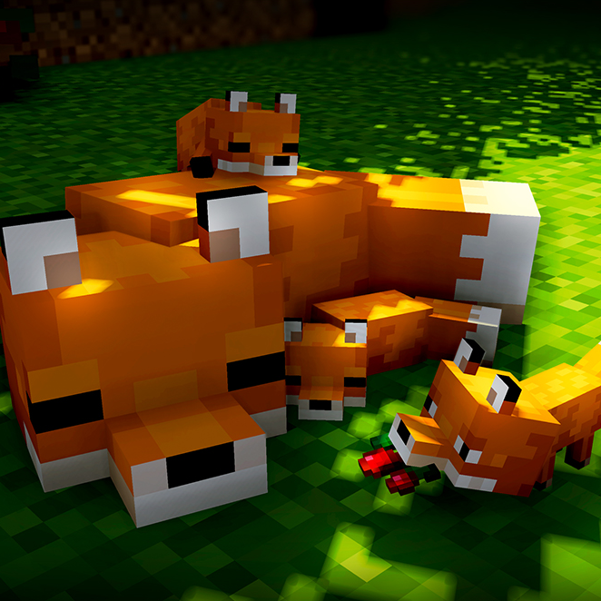

<h1 align="center"> 🦊 Adventures Of Fox: Beginning Of A Journey 🦊 </h1>

    

<h2 align="center">Description</h2>

Welcome to my modpack! It was created for **Adventure** and **Exploring** with **Quests**. It adds **bunch of structures** and new **massive updated nether** with **updated end** making them worth to explore. It has bunch of **new weapons** to use with **new mobs mechanics** making them interesting and harder giving **little challenge** to player. For people that want use **texturepacks or shaders**, we have support for that! You just need download your **shaders/texturepack** and put into right folder. And for people who love **building** there are mods that add bunch of **new blocks for building and decorative**! Oh, and i could forgot, there are **quests** that will make your adventure not worthless showing you everysingle corner in modpack. Modpack is also optimazed in aspect of **rendering chunks, light, mobs etc.** All features of modpack you can find bellow. Modpack adds +170 mods and It's for fabric 1.18.1.
